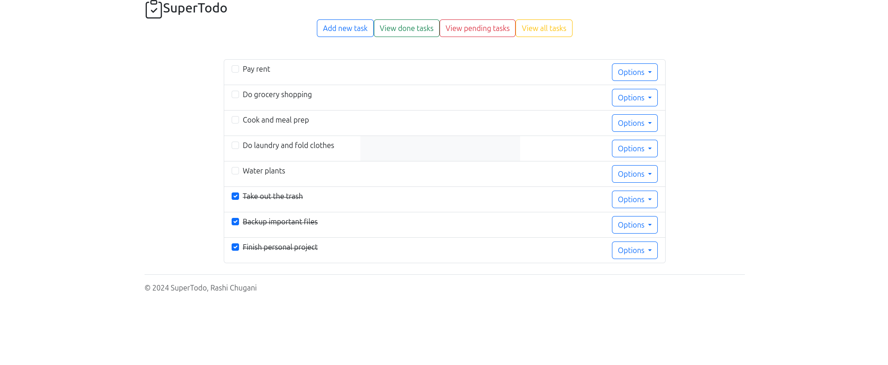

# Supertodo

  

## Content
- [Description](#description)

### Description
A task management application built with Django, Python and Bootstrap that allows users to create, organize and mark tasks as completed. With an intuitive and adaptable interface, users can add, edit and delete tasks from their to-do list, and easily clean up completed tasks to maintain an orderly workflow. Ideal for managing daily tasks in a simple and efficient way.
